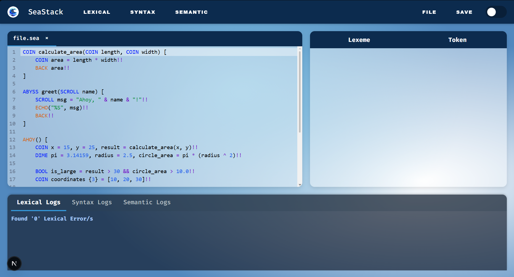
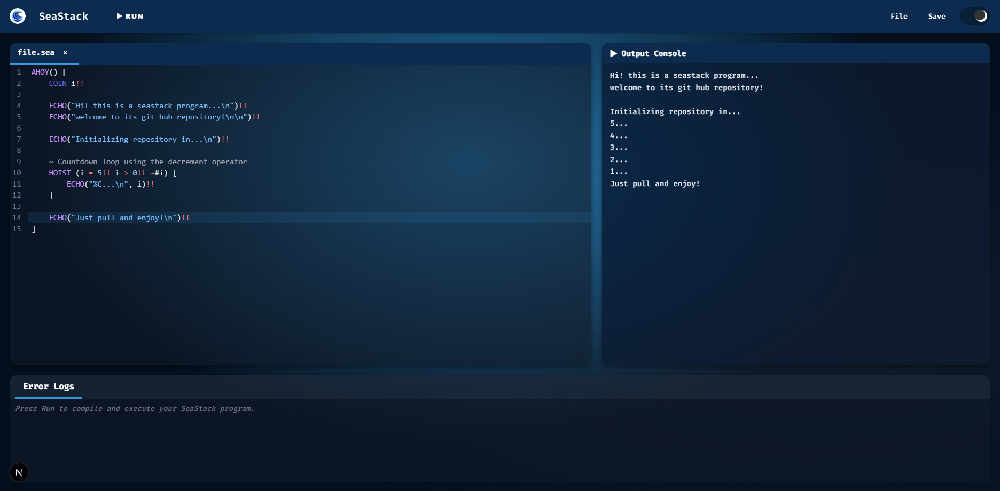

# 🌊 SeaStack | Programming Language and Compiler
A C-inspired programming language with an oceanic twist — built from scratch for automata theory and formal languages. SeaStack is a high-level programming language designed to combine structured programming principles with a thematic and engaging syntax inspired by the Ocean Voyager theme. 

It takes its foundation from the C language, adapting familiar constructs such as functions, loops, conditionals, and data type.  This built as part of an academic project in automata theory and formal languages, SeaStack includes its own lexer, parser, and GUI-based IDE.

### 🌕 IDE - Light Mode


### 🌑 IDE - Dark Mode


## Language Rules (to be added in the future)

## 📂 Project Structure
```plaintext
SEASTACK_PROJ/
├── backend/
│   ├── lexical/
│   │   ├── handlers/
│   │   ├── lexer_token.py
│   │   └── lexer.py
│   ├── syntax/
│   │   ├── __pycache__/
│   │   ├── __init__.py
│   │   ├── First_Set.py
│   │   ├── Follow_Set.py
│   │   ├── Predict_Set.py
│   │   └── syn_parser.py
│   ├── README.md
│   └── server.py
├── frontend/
│   ├── .next/
│   ├── node_modules/
│   ├── public/
│   ├── src/
│   │   ├── app/
│   │   │   ├── favicon.ico
│   │   │   ├── globals.css
│   │   │   ├── layout.js
│   │   │   └── page.js
│   │   └── components/
│   │       └── CodeEditor.js
│   ├── .gitignore
│   ├── eslint.config.mjs
│   ├── jsconfig.json
│   ├── next.config.mjs
│   ├── package-lock.json
│   ├── package.json
│   ├── postcss.config.mjs
│   └── README.md
├── node_modules/
├── package-lock.json
├── package.json
├── README.md
├── sample.sea
└── test_compiler.py
 ```

## 🖥️ How to Run
Follow these steps to set up and run SeaStack locally on your computer.

### 🔑 Prerequisites
Ensure you have the following installed:
- Node.js (v18 or higher recommended)
- Python (v3.10 or higher recommended)

Navigate to the root directory and install the required Python libraries:
```plaintext 
pip install -r requirements.txt
```

**▶️ Frontend & Root Setup (Node.js)**<br>
Install dependencies for the root project (to run the scripts) and the frontend interface:
```plaintext 
# 1. Install root dependencies (for the 'concurrently' script)
npm install

# 2. Install frontend dependencies (for React/Next.js)
cd frontend
npm install
cd ..
```

**▶️ Run the Application**<br>
Start both servers with one command from the root directory:
```plaintext 
npm run dev
```

## 👥 Contributors
- ALISWAG, K. V. J.
- ALTEZA, J. R. D.
- CAYACAP, F. A. S.
- DEL ROSARIO, J. M. A.
- MAGAAN, F. M. V.
- MULLENO, J. M. A.
